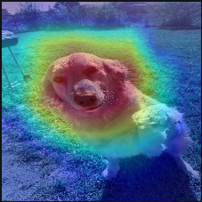

# AI Image Processing and Classification Project

This project is designed to give you hands-on experience working with an image classifier and enhancing your programming skills using AI assistance. The project has three parts, each focused on different aspects of image classification and processing. By the end, you'll have explored fundamental concepts like Grad-CAM, image occlusion, and creative image filtering.

# Part 1: Using the Basic Classifier and Implementing Grad-CAM

### Top 3 Predictions and Confidence Scores
- golden_retriever (0.80)
- Labrador_retriever (0.05)
- Pembroke (0.01)

**Screenshot:**

)

### Heatmap Analysis

**Screenshot:**

**Observation:**

The classifier seems to be focusing mostly on my golden retriever’s head and face to help identify what the image is. The heatmap shows the hottest areas concentrated around her nose, eyes, ears, and the overall shape of her head.

# Part 2: Experimenting with Image Occlusion

### Top 3 Predictions and Confidence Scores
-
-
-

**Screenshot:**

### Occlusions Analysis

**Screenshot:**

**Observation:**
- Compare the classifier's performance on the original image vs. the occluded versions.

**Answer the following questions:**
- Did the classifier struggle to classify the occluded images?

- Which occlusion had the greatest impact on performance?

# Part 3: Creating and Experimenting with Image Filters

### Filter Addition
**Explanation:**

**Link:**

[basic_filter.py](link goes here)