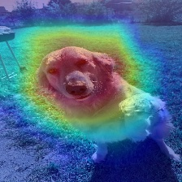

# AI Image Processing and Classification Project

This project is designed to give you hands-on experience working with an image classifier and enhancing your programming skills using AI assistance. The project has three parts, each focused on different aspects of image classification and processing. By the end, you'll have explored fundamental concepts like Grad-CAM, image occlusion, and creative image filtering.

# Part 1: Using the Basic Classifier and Implementing Grad-CAM

### Top 3 Predictions and Confidence Scores
- golden_retriever (0.80)
- Labrador_retriever (0.05)
- Pembroke (0.01)

**Screenshot:**

)

### Heatmap Analysis

**Screenshot:**

**Observation:**

The classifier seems to be focusing mostly on my golden retriever’s head and face to help identify what the image is. The heatmap shows the hottest areas concentrated around her nose, eyes, ears, and the overall shape of her head.

# Part 2: Experimenting with Image Occlusion

### Top 3 Predictions and Confidence Scores

Classifying original image: kami.png
- golden_retriever (0.80)
- Labrador_retriever (0.05)
- Pembroke (0.01)

Results for occl_black.jpg:
- spotlight (0.52)
- bubble (0.13)
- stage (0.05)

Results for occl_blur.jpg:
- spotlight (0.53)
- bubble (0.13)
- stage (0.05)

Results for occl_noise.jpg:
- electric_ray (0.10)
- lampshade (0.09)
- umbrella (0.09)

**Screenshot:**

Black Box Occlusion

Gaussian Blur

Noise Injection

### Occlusions Analysis

**Observation:**

After applying three different occlusion methods on the Grad-CAM heatmap, the classifier’s performance dropped SIGNIFICANTLY. The top prediction changed from “Golden Retriever” to unrelated objects like “Spotlight” and “Electric Ray,” with much lower confidence scores.

**Did the classifier struggle to classify the occluded images?**

Yes, the classifier drasticly struggled once the Grad-CAM was occluded. In the original image, the model correctly predicted golden_retriever with 80% confidence. After applying each occlusion, the predictions came out with completely unrelated objects such as spotlight, electric_ray, and lampshade, with significantly lower confidence scores.

**Which occlusion had the greatest impact on performance?**

The noise injection had the greatest impact. Not only did the classifier fail to recognize the original object, but the top-3 predictions became unrelated and confidence was extremely low (all around 9–10%). Even though the black box and blur also caused the model to misclassify the image as a "spotlight," they still held slightly more consistency and confidence. The noise disrupted both structure and texture, leading to a complete loss in prediction reliability.

# Part 3: Creating and Experimenting with Image Filters

### Filter Addition

- Batman Beyond Infrared Vision
- Cyberpunk Glitch
